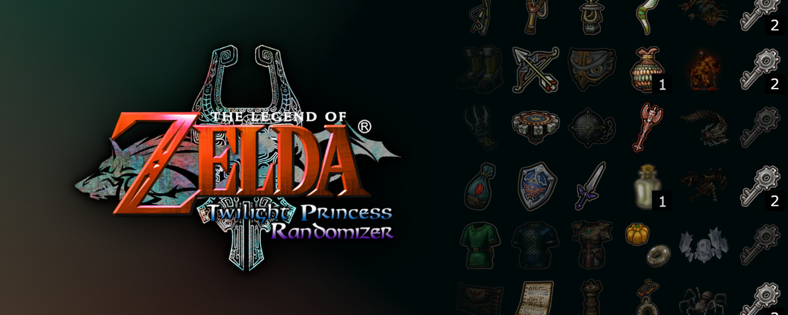

# midna

An item tracker for Twilight Princess Randomizer

------------------------------------------------------------------------------



## What is midna?

_midna_ is an item tracker for Twilight Princess Randomizer, a version of The
Legend of Zelda: Twilight Princess in which items can be shuffled around into
different locations with each playthrough, among other changes to the game
logic. If you're interested in the randomizer and want to learn more, visit the
[TPR website](https://tprandomizer.com/).

Shout out to [lunarsoap5](https://github.com/lunarsoap5) for contributing to
such a fantastic randomizer, and for making the [online
tracker](https://tracker.zeldatp.net/) from which many of the item images were
taken.

## Why the name?

A tool for Twilight Princess called _midna_? Who could have thought of such an
original and unique name?

## What does it do?

If you've used lunarsoap's tracker, or any other kind of tracker for various
randomizers, then _midna_ won't surprise you -- it displays a grid of items and
you can click them to show that they are in your inventory during a playthrough.
Some items are just a single object and can be toggled on and off, others are
progressive and cycle through various states, and others still can be collected
up to a numerical maximum. In the case of numbered items, when you have reached
the maximum number, the integer in the corner of the image will become green.

However, _midna_ is my attempt at adding some nice quality of life features to
what I've found in other TP trackers. For example, this tracker allows the user
to save the state of the tracker to a file, and load that file at a later time.
You can also save and load a template file, which is what will be read when the
program starts. There's a button to fully clear the tracker, and a slider to
resize images on the fly. Configuration options can also be modified during
runtime by making changes in the settings menu.

You can move items around to reorder the layout of the tracker, which means
different users with different layout preferences can spend time organizing the
tracker how they like, and then overwrite the template to make the layout change
permanent.

Items the tracker includes are the following:
- Fishing Rod (w/Coral Earring)
- Slingshot
- Lantern
- Gale Boomerang
- Iron Boots
- Hero's Bow (w/Big and Giant Quivers)
- Hawkeye
- Bomb Bags
- Giant Bomb Bag
- Clawshot and Double Clawshot
- Spinner
- Ball and Chain
- Dominion Rod (Unpowered and Powered)
- Wallet (w/Big and Giant Wallets)
- Shield (Ordon, Wooden, and Hylian)
- Sword (Wooden, Ordon, Master, and Light)
- Bottles (4)
- Zora Armor
- Magic Armor
- Ancient Sky Book (w/Sky Characters)
- Auru's Memo
- Ashei's Sketch
- Horse Call
- Golden Bugs (24)
- Poe Souls (60)
- Hidden Skills (7)
- Green Rupees (2)
- Shadow Crystal
- Dungeon Items
  - All Boss Keys
  - All Dungeon Rewards (Fused Shadow/Mirror Shard)
  - All Small Keys

## How can I run it?

At the moment there is no standalone executable for _midna_, though I would like
to make one in the future. So for the time being, you will need to have Python
installed with tkinter (in most cases tkinter is part of the standard library,
so you should not need to install it separately). To download Python, go to
[this link](https://www.python.org/downloads/).

In addition to Python, you will need to install the `Pillow` library, which is
what it uses to manipulate and display the images. To install `Pillow`, you can
use the following command:

`$ pip install Pillow`

Most Python installations include the `pip` tool, but if you don't have it you
may need to install it as well.

Once you have all the dependencies, you can run the tracker by navigating to the
base directory and invoking the `midna` script, like so:

```
$ git clone https://github.com/Nynergy/midna.git
$ cd midna/
$ ./midna
```

## How do I use it?

To toggle or increment an item, just left click on it. Right clicking on an item
progresses the state backwards instead.

To move an item around, hover over it with the mouse, then use the arrow keys to
swap it with the item in a specified direction.

To save and load a state/template, use the buttons below the item grid. All
state and template files used by _midna_ are JSON files.

To clear the tracker, just hit the 'Clear Tracker' button.

To resize the item images, use the slider at the bottom of the tracker. At the
moment, images can be scaled to any square size between 10px and 120px.

To open the settings menu and change colors or other default configurations, hit
the 'Settings' button in the bottom right corner of the tracker.

## How do I configure it?

_midna_ uses a 'config.json' file to store configuration data such as colors,
default image size, and toggling the title bar. You can manually edit this
config file if you like, or you can set values for it in the settings menu of
the tracker.

Once you've opened the settings menu, click on a color to open a color picker
and set it to the new desired color. You can also enter a new default image
size, which is the size of images when the tracker first opens, and you can
toggle the title bar that appears above the item grid on and off.

After setting everything to your liking, hit the 'Apply Changes' button to write
those changes to the config file.

## What now?

Go play some rando, and let _midna_ help keep you on track :)
